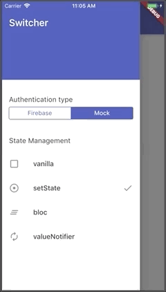

## State Management Comparison: Authentication Flow

This is a sample app showing different approaches to managing state in Flutter:

### [`setState`](https://flutter.dev/docs/development/data-and-backend/state-mgmt/options#setstate) vs [`BLoC`](https://flutter.dev/docs/development/data-and-backend/state-mgmt/options#bloc--rx) vs [`ValueNotifier`](https://api.flutter.dev/flutter/foundation/ValueNotifier-class.html)/[`ChangeNotifier`](https://api.flutter.dev/flutter/foundation/ChangeNotifier-class.html) with [Provider](https://pub.dev/packages/provider)

Use case: 

- **Setting a loading state while an authentication request is in progress**

### Preview

YouTube video walk-through here: 

## Reference

- [Flutter Docs: List of state management approaches](https://flutter.dev/docs/development/data-and-backend/state-mgmt/options)

## [License: MIT](LICENSE.md)
